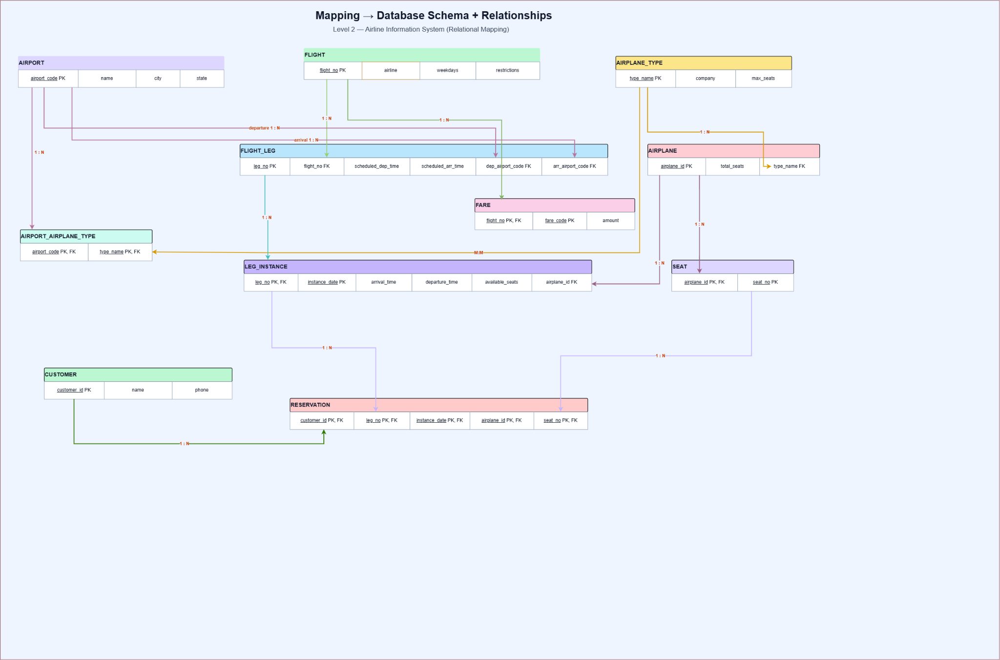

# Airline — ER-to-Relational Mapping

[Full-size image](Level2_Airline_Mapping_DiagramsNet_Styled.drawio.png) · [Editable diagrams.net file](Airline_Relational_Mapping.drawio)

Source: Task 2 (Design ERDs), INTERMEDIATE airline case study supplied in the request. This mapping follows that text, with the modeling assumptions below.

## Notation

**PK** = primary key; **FK** = foreign key. All PK-marked columns in a table form **one** primary key. A bracketed group is **one composite foreign key**, not several independent FKs. Required relationship FKs are non-null. Foreign-key references appear within the table cards to avoid crossing lines.

## Relational schemas

### AIRPORT

| Column | Key |
|---|---|
| airport_code | PK |
| name | — |
| city | — |
| state | — |

**Primary key:** `(airport_code)`.

### FLIGHT

| Column | Key |
|---|---|
| flight_no | PK |
| airline | — |
| restrictions | — |

**Primary key:** `(flight_no)`.

- flight_no: assumed global flight identifier.

### FLIGHT_LEG

| Column | Key |
|---|---|
| leg_no | PK |
| flight_no | FK |
| dep_airport_code | FK |
| arr_airport_code | FK |
| scheduled_dep_time | — |
| scheduled_arr_time | — |

**Primary key:** `(leg_no)`.

- FK `(flight_no)` → `FLIGHT(flight_no)`.
- FK `(dep_airport_code)` → `AIRPORT(airport_code)`.
- FK `(arr_airport_code)` → `AIRPORT(airport_code)`.

### AIRPLANE_TYPE

| Column | Key |
|---|---|
| type_name | PK |
| company | — |
| max_seats | — |

**Primary key:** `(type_name)`.

### AIRPLANE

| Column | Key |
|---|---|
| airplane_id | PK |
| type_name | FK |
| total_seats | — |

**Primary key:** `(airplane_id)`.

- FK `(type_name)` → `AIRPLANE_TYPE(type_name)`.

### LEG_INSTANCE

| Column | Key |
|---|---|
| leg_no | PK/FK |
| flight_date | PK |
| airplane_id | FK |
| departure_time | — |
| arrival_time | — |
| available_seats | — |

**Primary key:** `(leg_no, flight_date)`.

- FK `(leg_no)` → `FLIGHT_LEG(leg_no)`.
- FK `(airplane_id)` → `AIRPLANE(airplane_id)`.
- PK = (leg_no, flight_date).

### CUSTOMER

| Column | Key |
|---|---|
| customer_id | PK |
| name | — |
| phone | — |

**Primary key:** `(customer_id)`.

- customer_id is an introduced surrogate key.

### INSTANCE_SEAT

| Column | Key |
|---|---|
| leg_no | PK/FK |
| flight_date | PK/FK |
| seat_no | PK |

**Primary key:** `(leg_no, flight_date, seat_no)`.

- FK `(leg_no, flight_date)` → `LEG_INSTANCE(leg_no, flight_date)`.
- PK = (leg_no, flight_date, seat_no).
- A seat occurrence within one leg instance.

### RESERVATION

| Column | Key |
|---|---|
| leg_no | PK/FK |
| flight_date | PK/FK |
| seat_no | PK/FK |
| customer_id | FK |

**Primary key:** `(leg_no, flight_date, seat_no)`.

- FK `(leg_no, flight_date, seat_no)` → `INSTANCE_SEAT(leg_no, flight_date, seat_no)`.
- FK `(customer_id)` → `CUSTOMER(customer_id)`.
- PK = (leg_no, flight_date, seat_no).
- At most one current booking per instance seat.

### FARE

| Column | Key |
|---|---|
| flight_no | PK/FK |
| code | PK |
| amount | — |

**Primary key:** `(flight_no, code)`.

- FK `(flight_no)` → `FLIGHT(flight_no)`.
- PK = (flight_no, code).

### CAN_LAND

| Column | Key |
|---|---|
| airport_code | PK/FK |
| type_name | PK/FK |

**Primary key:** `(airport_code, type_name)`.

- FK `(airport_code)` → `AIRPORT(airport_code)`.
- FK `(type_name)` → `AIRPLANE_TYPE(type_name)`.
- PK = (airport_code, type_name).

### FLIGHT_WEEKDAY

| Column | Key |
|---|---|
| flight_no | PK/FK |
| weekday | PK |

**Primary key:** `(flight_no, weekday)`.

- FK `(flight_no)` → `FLIGHT(flight_no)`.
- PK = (flight_no, weekday).
- One row per operating weekday.

## Relationship mapping

| ER relationship | Cardinality | Relational mapping |
|---|---|---|
| Flight contains legs | 1:M | FLIGHT_LEG.flight_no |
| Airport is departure point | 1:M | FLIGHT_LEG.dep_airport_code |
| Airport is arrival point | 1:M | FLIGHT_LEG.arr_airport_code |
| Leg has dated instances | 1:M, identifying | LEG_INSTANCE PK (leg_no, flight_date) |
| Type classifies airplanes | 1:M | AIRPLANE.type_name |
| Airplane operates leg instances | 1:M | LEG_INSTANCE.airplane_id |
| Airport permits airplane types | M:N | CAN_LAND(airport_code, type_name) |
| Flight has fares | 1:M, fare code local to flight | FARE PK (flight_no, code) |
| Flight operates on weekdays | Multivalued attribute | FLIGHT_WEEKDAY(flight_no, weekday) |
| Instance provides seats | 1:M, identifying | INSTANCE_SEAT PK (leg_no, flight_date, seat_no) |
| Instance seat has a current reservation | 1:0..1 | RESERVATION PK is also an FK to INSTANCE_SEAT |
| Customer makes reservations | 1:M | RESERVATION.customer_id |

## Weak entities and the three-way reservation

- A **LEG_INSTANCE** is identified by the owner's `leg_no` plus the partial key `flight_date`. It cannot refer to a nonexistent leg.
- **INSTANCE_SEAT** represents the seat *in a specific dated leg*, not a globally unique physical seat. Seat 12A on another date is a different instance seat. Its owner FK is `(leg_no, flight_date)`.
- **RESERVATION** associates **Customer + Seat + Leg Instance** in one record. Its columns are `(leg_no, flight_date, seat_no, customer_id)`. The seat and instance are jointly identified by the composite INSTANCE_SEAT FK; the customer has its own FK. This preserves the three-way association rather than decomposing it into unrelated pairwise bookings.
- The reservation PK `(leg_no, flight_date, seat_no)` expresses the business rule that one seat in one instance has at most one current customer. A customer is therefore **not** part of the PK: including customer_id would incorrectly permit two customers to book the same instance seat.
- Adding INSTANCE_SEAT makes the seat inventory explicit, including seats with no reservation. In a more compact model it can be omitted, with seat_no retained as a reservation discriminator and a direct FK to LEG_INSTANCE; the chosen model keeps the Seat participant visible.

Example: `RESERVATION(17, 2026-10-05, '12A', 501)` means customer 501 reserved seat 12A on leg 17 on October 5. That exact instance-seat tuple must exist. Booking the same tuple for customer 502 violates the PK. Seat 12A on a different date is allowed.

## Modeling decisions and assumptions

1. **leg_no is globally unique**, exactly as the supplied text states. It is not silently changed to `(flight_no, leg_no)`. Flight–Leg is 1:M, but Flight Leg is not weak by identification under this assumption.
2. Introduce **flight_no** as the global FLIGHT key because a flight identifier was not specified. If real flight numbers are only unique within an airline, use an airline/flight-number composite key or a surrogate flight_id instead.
3. Assume at most **one occurrence per leg per date**. Multiple daily occurrences require a further discriminator such as instance_no and corresponding changes to dependent keys.
4. Introduce **customer_id** as a surrogate key. Neither name nor phone is assumed unique. Customer remains a separate entity for repeat reservations.
5. Model **Weekdays** as multivalued, with one row per weekday in FLIGHT_WEEKDAY. Assume **Restrictions** is a single flight-level text attribute, as listed in the question; it is not moved to FARE.
6. Treat **fare code** as unique only within a flight; hence FARE has composite PK `(flight_no, code)`. Assume one currency for amounts because no currency was specified.
7. Treat **type_name** as globally unique. Each airplane belongs to one type and each leg instance is assigned one airplane.
8. **seat_no** is a text label such as `12A`, scoped to a leg instance. This exercise models the seat inventory for each occurrence; it does not add a physical airplane-seat catalog.
9. This is a **current-reservation** model. Cancellations remove the current booking; historical bookings or repeat reservations need an extended lifecycle model, which the task does not request. No extra restriction of one seat per customer per instance is assumed.
10. Departure and arrival airports are two different roles referencing AIRPORT. Actual airport diversions are outside the supplied attributes. Actual arrival/departure values should use date-time values in implementation so overnight legs are representable; use a documented timezone convention.
11. Minimum participation on parent entities is not enforced by an FK alone. For example, the requirement that a flight includes legs requires workflow/application validation when a flight is finalized.

## Integrity rules beyond PK/FK

- `max_seats > 0`; `total_seats > 0`; `amount >= 0`; `available_seats >= 0`.
- AIRPLANE.total_seats must not exceed its type's max_seats. This spans tables and requires validation beyond a simple row CHECK.
- Populate each instance's seat inventory consistently with its assigned airplane. Aircraft reassignment requires revalidating inventory and existing bookings.
- With no blocked seats modeled, available_seats equals the number of INSTANCE_SEAT rows minus current RESERVATION rows for that instance. Derive it when queried, or maintain the supplied count transactionally if stored.
- Validate the assigned airplane type against CAN_LAND for both leg airports.
- Use weekday values consistently, e.g. integers 1–7, and preserve phone numbers as text.
- No Pilot, Crew, Ticket, payment, or baggage tables are added because they are absent from this version of the task.

## شرح مختصر

- **LEG_INSTANCE** هي تشغيل رحلة جزئية في تاريخ محدد؛ مفتاحها `(leg_no, flight_date)`.
- **INSTANCE_SEAT** يحدد المقعد داخل هذا التشغيل، مثل المقعد `12A` في رحلة يوم معين.
- **RESERVATION** يربط العميل بهذا المقعد وهذا التشغيل؛ المفتاح المركب يمنع حجز المقعد نفسه مرتين.
- **CAN_LAND** يحوّل علاقة المطارات وأنواع الطائرات **M:N** إلى جدول ربط.
- **FLIGHT_WEEKDAY** يحوّل أيام تشغيل الرحلة إلى صفوف مستقلة بدل تخزين قائمة داخل عمود واحد.
- أضفنا **customer_id** لأن الاسم ورقم الهاتف لا يكفيان كمفتاح مضمون التفرد.
