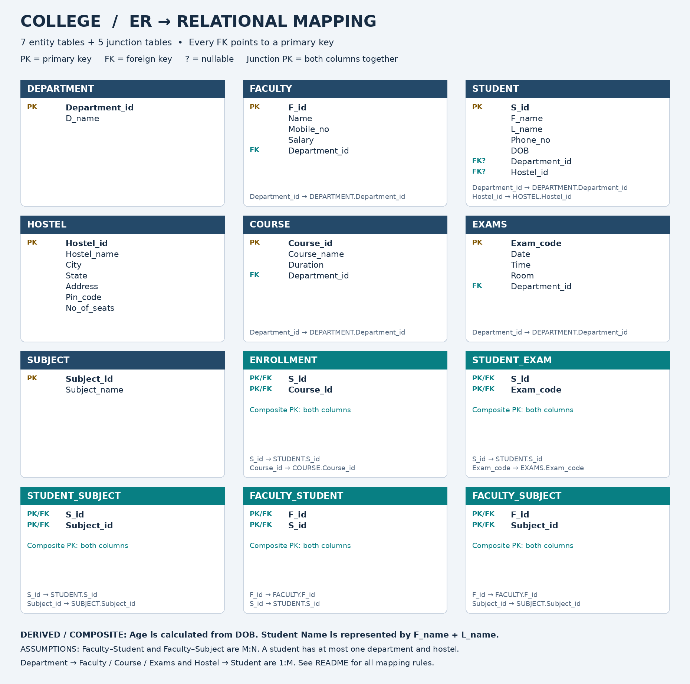

# College — ER-to-Relational Mapping

[Open full-size image](College_Relational_Mapping.png) · [Download editable diagrams.net file](College_Relational_Mapping.drawio)

Source: Task 2 (Design ERDs), EASY college case study supplied in the request.

## Notation

- **PK**: primary key. **FK**: foreign key. **FK?**: nullable foreign key.
- In every junction table, the two columns form **one composite primary key**; each column also references its parent table.
- Foreign-key targets are printed inside each table card to keep the diagram readable without crossing lines.

## Relational schemas

### DEPARTMENT

| Column | Key |
|---|---|
| Department_id | PK |
| D_name | — |

### FACULTY

| Column | Key |
|---|---|
| F_id | PK |
| Name | — |
| Mobile_no | — |
| Salary | — |
| Department_id | FK |

- Department_id → DEPARTMENT.Department_id

### STUDENT

| Column | Key |
|---|---|
| S_id | PK |
| F_name | — |
| L_name | — |
| Phone_no | — |
| DOB | — |
| Department_id | FK? |
| Hostel_id | FK? |

- Department_id → DEPARTMENT.Department_id
- Hostel_id → HOSTEL.Hostel_id

### HOSTEL

| Column | Key |
|---|---|
| Hostel_id | PK |
| Hostel_name | — |
| City | — |
| State | — |
| Address | — |
| Pin_code | — |
| No_of_seats | — |

### COURSE

| Column | Key |
|---|---|
| Course_id | PK |
| Course_name | — |
| Duration | — |
| Department_id | FK |

- Department_id → DEPARTMENT.Department_id

### EXAMS

| Column | Key |
|---|---|
| Exam_code | PK |
| Date | — |
| Time | — |
| Room | — |
| Department_id | FK |

- Department_id → DEPARTMENT.Department_id

### SUBJECT

| Column | Key |
|---|---|
| Subject_id | PK |
| Subject_name | — |

### ENROLLMENT

| Column | Key |
|---|---|
| S_id | PK/FK |
| Course_id | PK/FK |

- S_id → STUDENT.S_id
- Course_id → COURSE.Course_id

### STUDENT_EXAM

| Column | Key |
|---|---|
| S_id | PK/FK |
| Exam_code | PK/FK |

- S_id → STUDENT.S_id
- Exam_code → EXAMS.Exam_code

### STUDENT_SUBJECT

| Column | Key |
|---|---|
| S_id | PK/FK |
| Subject_id | PK/FK |

- S_id → STUDENT.S_id
- Subject_id → SUBJECT.Subject_id

### FACULTY_STUDENT

| Column | Key |
|---|---|
| F_id | PK/FK |
| S_id | PK/FK |

- F_id → FACULTY.F_id
- S_id → STUDENT.S_id

### FACULTY_SUBJECT

| Column | Key |
|---|---|
| F_id | PK/FK |
| Subject_id | PK/FK |

- F_id → FACULTY.F_id
- Subject_id → SUBJECT.Subject_id

## Relationship mapping

| ER relationship | Cardinality used | Relational mapping |
|---|---|---|
| Department has faculty | 1:M (assumption) | FACULTY.Department_id FK |
| Student belongs to department | 1:M; student 0..1 department | STUDENT.Department_id nullable FK |
| Hostel accommodates students | 1:M; student 0..1 hostel | STUDENT.Hostel_id nullable FK |
| Department handles courses | 1:M | COURSE.Department_id FK |
| Department conducts exams | 1:M | EXAMS.Department_id FK |
| Student enrolls in courses | M:N | ENROLLMENT(S_id, Course_id) |
| Student takes exams | M:N (assumption: exam can have many students) | STUDENT_EXAM(S_id, Exam_code) |
| Student takes subjects | M:N (assumption) | STUDENT_SUBJECT(S_id, Subject_id) |
| Faculty teaches students | M:N (assumption) | FACULTY_STUDENT(F_id, S_id) |
| Faculty handles subjects | M:N (assumption) | FACULTY_SUBJECT(F_id, Subject_id) |

## Attribute decisions and assumptions

1. Every strong entity becomes a table with its supplied single-column primary key.
2. **Student Name** is treated as a composite of F_name and L_name. Store its components, not a duplicate Name column. Faculty Name stays a single attribute because no components were supplied.
3. **Age** is derived from DOB and the current date; do not store a value that becomes stale.
4. **Faculty Department** is represented by Department_id referencing DEPARTMENT, rather than repeating the department name. Assume each faculty member belongs to one department.
5. Each course and each exam belongs to one department. A student may have no department and may live off campus, so both student FKs are nullable.
6. Faculty–Student and Faculty–Subject are modeled as M:N because the reverse limits were unspecified. If one faculty member exclusively handles each subject, replace FACULTY_SUBJECT with F_id in SUBJECT.
7. Address is retained as the supplied address text (for example, street/building), alongside City, State and Pin_code; the prompt does not explicitly define Address as composite.
8. Phone_no and Mobile_no are single-valued because the prompt does not mark them as multivalued. No extra phone tables are introduced.
9. No Course–Subject or Exam–Subject relationship is invented: neither is stated in the supplied requirements. Faculty–Student remains a distinct teaching relationship and is not inferred from shared subjects.
10. Minimum participation on the parent side is unspecified. This mapping does not invent a requirement that every department, course, exam, hostel, or subject must already have a child record.

## How to read an M:N conversion

`STUDENT 1 → M ENROLLMENT M ← 1 COURSE`

One student can have many enrollment rows; one course can have many enrollment rows. The composite PK `(S_id, Course_id)` prevents recording the same student/course pair twice.

## شرح مختصر

- كل **Entity** يتحول إلى جدول، ومفتاحه يصبح **Primary Key**.
- في علاقة **1:M** نضع **Foreign Key** في جدول جهة الـ **Many**.
- في علاقة **M:N** ننشئ جدول ربط، ويكون المفتاح الأساسي مركبًا من مفتاحي الجدولين.
- **Age** نحسبه من **DOB**، واسم الطالب نخزنه في **F_name** و **L_name**.
- الافتراضات موضحة أعلاه لأن بعض الاتجاهات والحدود غير محددة في السؤال.
